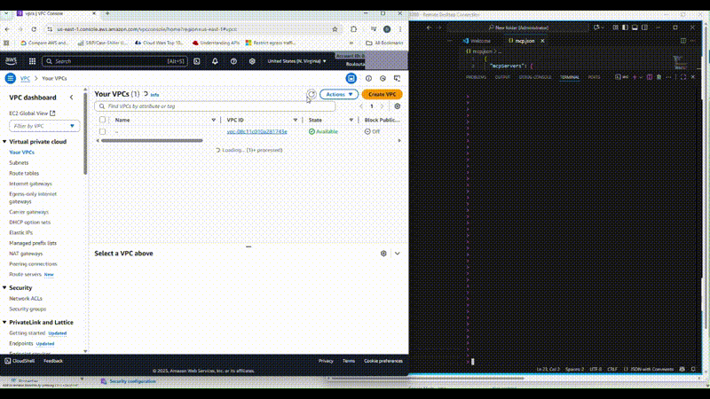

# 🚀 Natural Language as Code

## 👋 Bye Bye Terraform, Welcome Natural Language Infrastructure! 

Tired of writing complex YAML configurations and remembering countless Terraform syntax rules? Say hello to the future of infrastructure management - **Natural Language as Code**! 

Instead of this complicated Terraform:

```hcl
resource "kubernetes_deployment" "app" {
  metadata {
    name      = "my-app"
    namespace = "production"
    labels = {
      app = "my-app"
    }
  }
  spec {
    replicas = 3
    selector {
      match_labels = {
        app = "my-app"
      }
    }
    template {
      metadata {
        labels = {
          app = "my-app"
        }
      }
      spec {
        container {
          image = "nginx:1.21"
          name  = "nginx"
          port {
            container_port = 80
          }
        }
      }
    }
  }
}
```

Just say:
> **"Deploy nginx application with 3 replicas in production namespace"**

And watch the magic happen! ✨

## Demo Video

[Watch the Natural Language as Code Demo](./aws_nlp.mp4) - raw download
[]

---

##  Overview

**Natural Language as Code** revolutionizes infrastructure management by allowing developers and DevOps engineers to describe their infrastructure needs in plain English.

### Why Natural Language as Code?

**🎯 Intuitive**
___
Write infrastructure code the way you think about it

**⚡ Fast**
___
Deploy complex applications in seconds, not hours

**📚 Learning-Friendly**
___
Perfect for teams transitioning to cloud-native

---

### 🔮 What's Next?

### 🤖 Coming Soon: ChatBot Integration

**🌐 https://apps.infraid.gr/**

**🚀 Ready to revolutionize your infrastructure management?**
